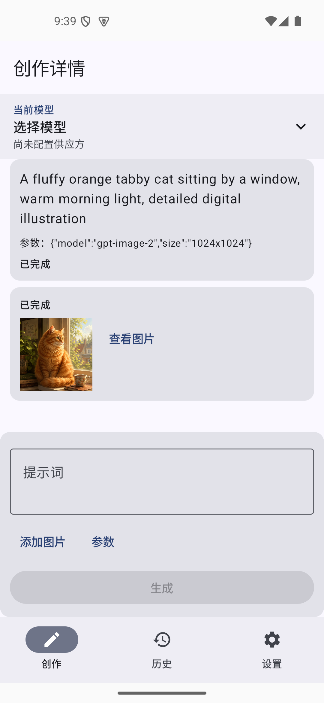
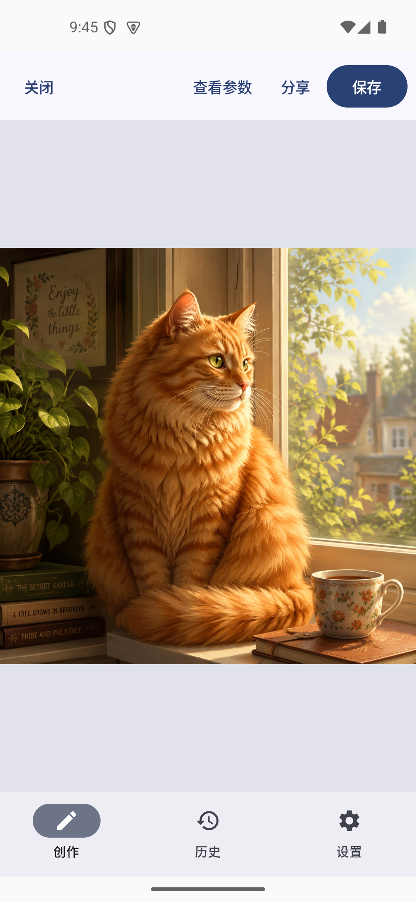
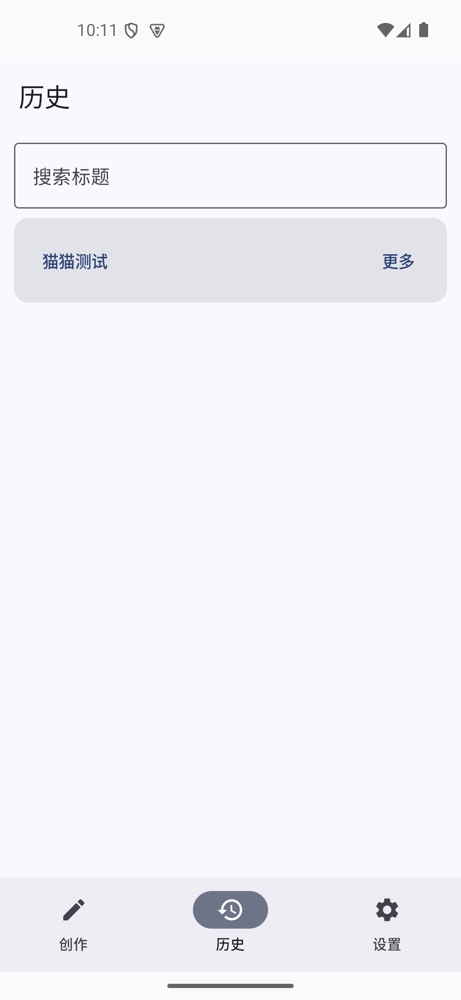

# ImgAd

[English](README_EN.md)

ImgAd 是一个 Android 10 及以上版本可用的本地优先 AI 图片客户端。它支持配置多个 OpenAI Images API 兼容供应方与模型，完成文生图、参考图编辑、历史管理、图片预览、保存、分享和本地归档。

## 主要功能

- 配置多个 OpenAI 兼容供应方，安全保存 API Key。
- 从供应方获取模型，并选择默认供应方和默认模型。
- 文生图、参考图编辑、蒙版和多图能力按模型配置启用。
- 长耗时生成、取消、失败详情和重试。
- 会话历史、图片缩略图、全屏预览和缩放。
- 保存到系统图库、通过 Android 分享面板分享。
- 导出和导入本地数据；默认归档不包含 API Key。

## 界面

<p align="center">
  
  
  
</p>

## 系统要求

- Android 10 / API 29 或更高版本
- JDK 17
- Android SDK 35

## 构建与安装

```bash
./gradlew assembleDebug
adb install -r app/build/outputs/apk/debug/app-debug.apk
```

## 配置供应方

1. 打开“设置”，选择“新增供应方”。
2. 填写供应方名称、OpenAI 兼容 API 地址和 API Key。
3. 点击“获取模型”，选择需要导入的图片模型并保存。
4. 设置默认供应方和默认模型，然后返回“创作”。

不同供应方对尺寸、质量、编辑、蒙版和多图参数的支持可能不同，请以供应方接口文档为准。

## 测试

```bash
./gradlew testDebugUnitTest connectedDebugAndroidTest lintDebug assembleDebug
```

项目已在 Android 15 / API 35 模拟器上验证。真机仍建议覆盖 Android 10、Android 14/15、图片选择器、系统图库、分享和后台恢复流程。

## 隐私与安全

- API Key 使用 Android Keystore 支持的加密存储，不写入普通 Room 字段。
- 图片、会话和配置默认保存在应用本地。
- 默认导出不包含 API Key；只有用户明确选择时才会使用密码加密密钥段。
- 生成请求会发送到用户自行配置的供应方，请在使用前确认其隐私政策和计费规则。

## 当前限制

- 仓库不提供已签名的正式 Release APK。
- 不包含账号、云同步或社区功能。
- 兼容性依赖供应方是否实现 OpenAI 风格的图片接口。
- 本项目当前未声明开源许可证。
